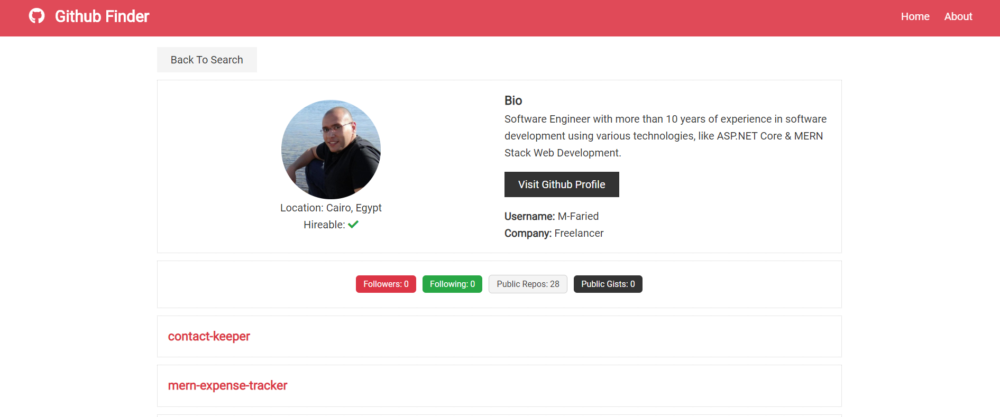

# 📐 Expense Tracker Web App (A demo application built using MERN full stack technologies)

Github Finder is a web application which enables users retrieve and search all developers on Github.

## 💻 Technologies:

* REACT framework for creating the clinet/front-end of the application.

* React Router.

* ContextAPI to manage the global state of the application.

* Github API

## 📷 Preview:

 

        

